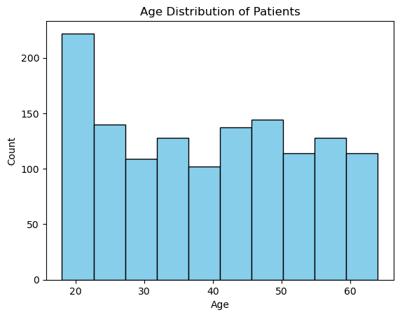
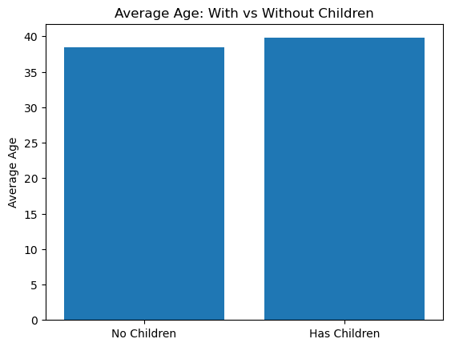
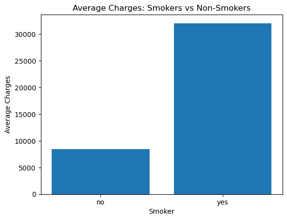
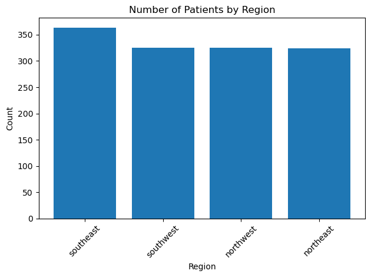

# US Medical Insurance Costs Analysis

This project analyzes a dataset of US medical insurance costs to explore patterns and relationships between patient characteristics and insurance charges. The goal is to showcase Python skills, logical thinking, and data analysis using `pandas`, `numpy`, and `matplotlib`.

## Dataset

The dataset `insurance.csv` contains information about patients, including:  

- Age  
- Sex  
- BMI  
- Number of children  
- Smoker status  
- Region  
- Insurance charges  

## Project Goals

- Explore the dataset and extract meaningful insights  
- Compare insurance charges between smokers and non-smokers  
- Visualize trends and distributions in the data  

## Analysis Steps

1. **Loaded the dataset**  
   - Imported the CSV into a `pandas` DataFrame for easy analysis.  

2. **Explored patient age distribution**  
   - Counted the number of patients in each age group.  
   - Plotted histogram to visualize the distribution.
   - Result: Most patients are in the 18–40 age range | average age is 39.  
   -   

3. **Analyzed average age by number of children**  
   - Grouped patients by the number of children and calculated average age.  
   - Plotted bar chart to see differences in age based on family size.
   - Result: Average age increases slightly with people who have children.  
   -   

4. **Compared insurance charges for smokers vs. non-smokers**  
   - Grouped data by `smoker` status and calculated average charges.  
   - Computed how many times non-smokers pay less than smokers.  
   - Plotted a bar chart to highlight the cost difference.
   - Result: Non-smokers pay significantly less than smokers | about 4 times!.  
   -   

5. **Explored regional distribution of patients**  
   - Counted patients per region.  
   - Plotted a pie chart or bar chart to visualize where most patients are from.
   - Result: Most patients are concentrated in the southeast region.  
   -   

## Libraries Used

- `pandas` – for data manipulation  
- `numpy` – for calculations and aggregations  
- `matplotlib` – for plotting visualizations  

## Conclusion

This project demonstrates the ability to:  

- Load and clean datasets  
- Extract insights using grouping and aggregation  
- Visualize data trends with clear charts  
- Communicate findings effectively  
